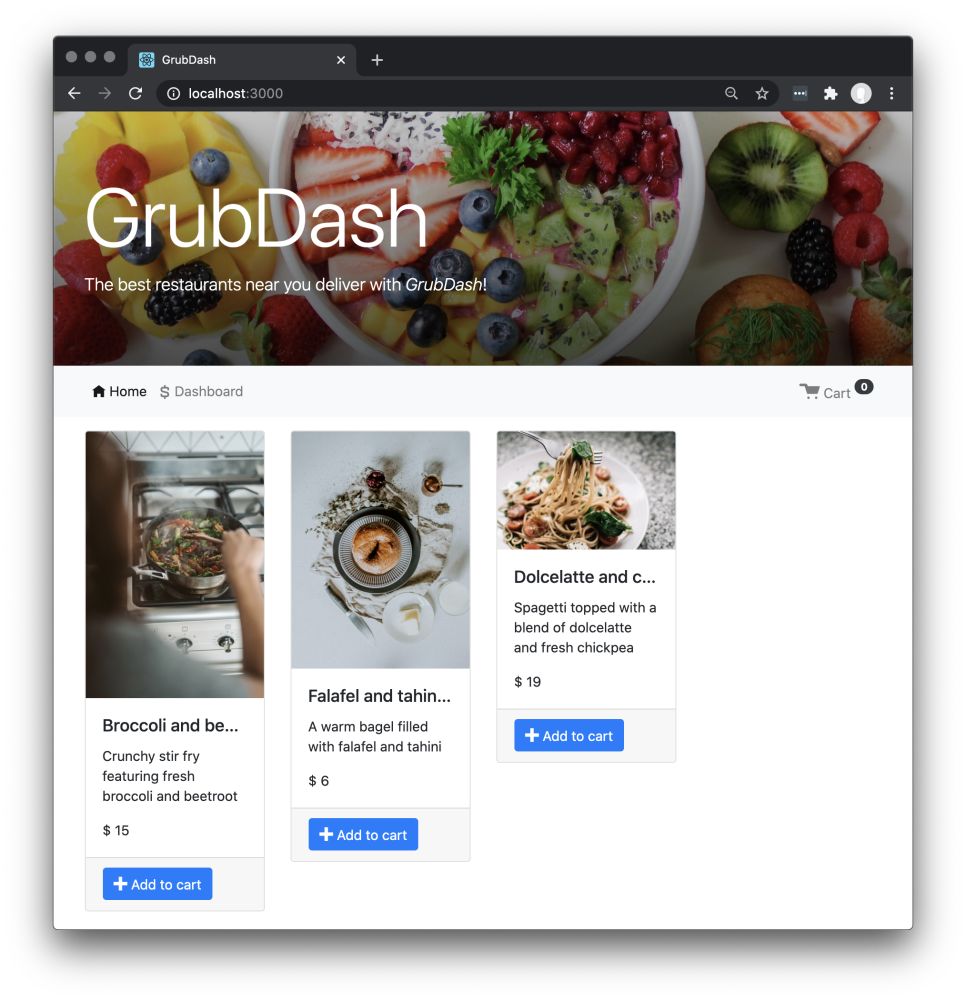

# Project: GrubDash - AP | Thinkful
GrubDash is a Thinkful project, focused on backend concepts. I was tasked with setting up an API and building out specific routes.

# Demonstrated the following:
- Running tests from command line
- Using common middleware packages
- Receive requests through routes
- Access relevant information through route parameters
- Build an API following RESTful design principles
- Write custom middleware functions

# Notes
- HTML and CSS files were given and did not need to be edited
- Frontend application was given and did not need to be edited

# Images
Home Page
